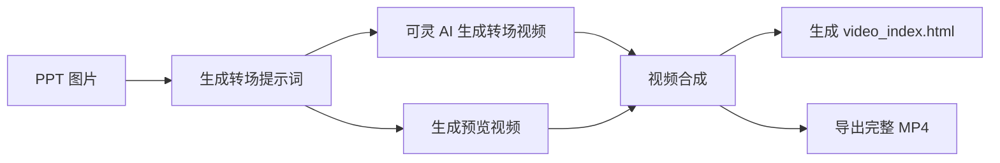
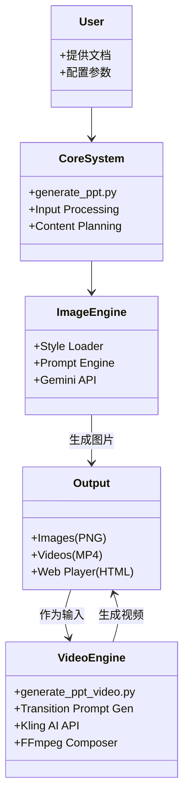

# 架构文档

## 🏗️ 模块化架构
NanoBanana-PPT-Skills 采用模块化设计，分为三个核心部分：

1. **核心生成模块 (Core Generation Module)**
   - 负责文档分析、内容规划
   - 调用 Gemini API 生成高质量 PPT 图片
   - 管理提示词工程和风格系统

2. **视频合成模块 (Video Synthesis Module)**
   - 负责转场提示词生成 (Claude/Gemini)
   - 调用可灵 AI 生成视频素材
   - 使用 FFmpeg 进行视频合成与处理

3. **播放器系统 (Player System)**
   - 提供基于 Web 的交互式演示体验
   - 支持纯图片模式和视频混排模式
   - 响应式设计，适配不同设备

---

## 🔄 工作流 (Workflows)

### 1. 基础流程 (Image Only)

### 2. 完整流程 (Image + Video)

---

## 🧩 系统架构概览

## 📁 关键组件说明

| 组件 | 文件 | 说明 |
|------|------|------|
| **Input Processing** | `prompt_file_reader.py` | 读取用户输入和 prompt 文件 |
| **Content Planning** | `generate_ppt.py` | 生成幻灯片结构规划 JSON |
| **Style Loader** | `generate_ppt.py` | 解析 `styles/*.md` 风格定义 |
| **Transition Gen** | `transition_prompt_generator.py` | 分析图片差异生成转场描述 |
| **Video API** | `kling_api.py` | 封装可灵 AI 视频生成接口 |
| **Composer** | `video_composer.py` | FFmpeg 视频拼接、缩放、合成 |
| **Material Mgr** | `video_materials.py` | 管理生成的视频片段素材 |

## 📦 输出结构
项目生成三种类型的输出：

1. **图片版本** (`outputs/TIMESTAMP/`)
   - `images/*.png`: 高清 PPT 图片
   - `index.html`: 纯图片播放器

2. **视频版本** (`outputs/TIMESTAMP_video/`)
   - `videos/*.mp4`: 转场视频片段
   - `video_index.html`: 交互式视频播放器
   - `full_ppt_video.mp4`: 完整合成视频

3. **中间数据**
   - `slides_plan.json`: 幻灯片规划
   - `transition_prompts.json`: 转场提示词
