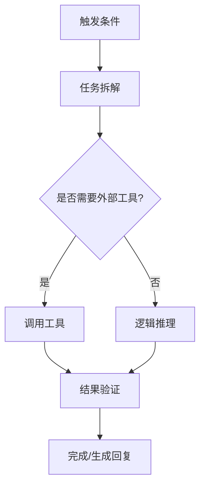

# Skill Template (Agent Skill)

---
name: "技能名称"
description: "简短且清晰的技能描述，说明该技能如何增强 Agent 的能力。"
---

## 核心逻辑 (Core Logic)

> 在此处列出该技能的核心系统指令。这些指令定义了 Agent 应该如何思考以及如何使用该技能。

- **思考模式**: ...
- **执行原则**: ...

## 工具/环境依赖 (Dependencies)

此技能需要的工具、API 或环境上下文：
- `tool_name`: 说明用途。

## 执行流程 (Workflow)

## 最佳实践与提示 (Best Practices)

- **建议**: ...
- **注意**: ...
